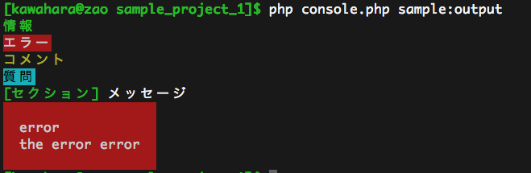

.. Symfony Advent Calendar 2012 - Day 2 documentation master file, created by
   sphinx-quickstart on Tue Nov 27 21:15:34 2012.
   You can adapt this file completely to your liking, but it should at least
   contain the root `toctree` directive.

=======================================
Symfony Advent Calendar JP 2012 - Day 2
=======================================

:Author: Shogo Kawahara <kawahara@bucyou.net> Twitter: `@ooharabucyou`_
:Date: 2012-12-02
:License: `Creative Commons Attribution 3.0 Unported License <http://creativecommons.org/licenses/by/3.0/>`_

.. _`@ooharabucyou`: http://twitter.com/ooharabucyou

こんにちは。 `@ooharabucyou`_ こと川原です。

`Symfony Advent Calendar JP 2012 <http://www.adventar.org/calendars/24>`_ の2日目です。

`<-1日目`_ **2日目(今ここ)** `3日目->`_

.. _`<-1日目`: http://d.hatena.ne.jp/brtRiver/20121201/1354336023
.. _`3日目->`: http://example.com/

今回は、Symfony Frameowrk についてではなく、 Symfony Framework を形作る要素である
Component を一つ取り上げます。 Component は、 Symfony2 を形作る一つの要素で
単体で使うことも可能な、非常に便利なものです。

概要
====

既存のライブラリの活用や、チームのプログラミング言語に対する熟練度など
を理由にして、PHPにおいてもバッチやCLIアプリケーションが作成されることが
あるかと思います。

もちろん、単純にフラットなものを作成しても良いですが、 Symfony Console
Component は、あなたの Console アプリケーションの作成を強力にサポートし
ます。

この Component は `PHPUnit <http://www.phpunit.de/manual/3.7/ja/index.html>`_ でも利用されています。

導入
====

前提として、もちろんPHP5.3 以降を用意する必要があります。

また、 `Composer <http://getcomposer.org/>`_ を利用することにより、簡単に Console Component を入手し、
活用することができます。まずは Composer を導入します。

Compoer
-------

`インストール方法 <http://getcomposer.org/doc/00-intro.md#installation-nix>`_ にしたがって、
Composer 自体を入手してください。 (作成途中ですが、`日本語もありますよ <https://github.com/kawahara/composer/blob/japanese-doc-progress/jpdoc/00-intro.md>`_ !)

そして、プロジェクトディレクトリに以下のような composer.json を追加します::

    {
        "require": {
            "symfony/console": "2.1.*"
        }
    }

そして、以下のコマンドを実行することにより Console Component 単体が手に入ります。::

    php composer.phar install

Hello World
-----------

Composer でライブラリを入手すると、 ``vendor/autoload.php`` が作成され、
そのファイルを読み込むだけで、個別の php ファイルを自動的にロードするようになります。

最も、単純な Console アプリケーションは、 ``Symfony\Component\Console\Application`` クラスを利用し、
それを実行することです。composer.json ファイルと同じ場所に、以下のような console.php を作成しましょう。

.. code-block:: php

    <?php

    require_once __DIR__.'/vendor/autoload.php';

    use Symfony\Component\Console\Application;

    $console = new Application();
    $console->run();

実行してみます。::

    $ php console.php
    Console Tool

    Usage:
      [options] command [arguments]

    Options:
      --help           -h Display this help message.
      --quiet          -q Do not output any message.
      --verbose        -v Increase verbosity of messages.
      --version        -V Display this application version.
      --ansi              Force ANSI output.
      --no-ansi           Disable ANSI output.
      --no-interaction -n Do not ask any interactive question.

    Available commands:
      help   Displays help for a command
      list   Lists commands

喜ばしいことに、標準で実行できるコマンドのリストが表示されます。
また、コマンドをひとつも実装していないので、利用できるコマンドは
help, list のみで、コマンドを指定しないと list が実行されます。

help はコマンドの詳細なヘルプを表示する、便利なコマンドです。

まずは、ひとつ挨拶をするコマンドを追加してみましょう。

.. code-block:: php

    <?php

    require_once __DIR__.'/vendor/autoload.php';

    use Symfony\Component\Console\Application;
    use Symfony\Component\Console\Input\InputInterface;
    use Symfony\Component\Console\Output\OutputInterface;

    $console = new Application();

    $console
        ->register('hello')
        ->setDescription('あいさつをします')
        ->setCode(function(InputInterface $input, OutputInterface $output) {
            $output->writeln('Hello World');
        });

    $console->run();

コマンドーが増えました。やったね。::

    $ php console.php
    Console Tool

    Usage:
      [options] command [arguments]

    Options:
      --help           -h Display this help message.
      --quiet          -q Do not output any message.
      --verbose        -v Increase verbosity of messages.
      --version        -V Display this application version.
      --ansi              Force ANSI output.
      --no-ansi           Disable ANSI output.
      --no-interaction -n Do not ask any interactive question.

    Available commands:
      hello   あいさつをします
      help    Displays help for a command
      list    Lists commands

hello 実行してみましょう。

    $ php console.php hello
    Hello World

このように、マイクロフレームワークのようなアプリケーションの書き方もできますし、
後述するやり方を使えば、特定の名前空間にあるクラスをロジックとして利用するという
こともできます。パワフルですね。

Console Component は、CLIアプリケーション界のフレームワークと言っても良いでしょう。

便利な機能
==========

入力
----

データの入力に関しては、コマンドに対して利用できる値やオプションを定義すると
``InputInterface`` をとおして受け取ることができます。

値を定義するには以下のように行います。

.. code-block:: php

    <?php

    require_once __DIR__.'/vendor/autoload.php';

    use Symfony\Component\Console\Application;
    use Symfony\Component\Console\Input\InputInterface;
    use Symfony\Component\Console\Output\OutputInterface;
    use Symfony\Component\Console\Input\InputArgument;

    $console = new Application();

    $console
        ->register('hello:yourname')
        ->setDescription('名前付きで挨拶をします')
        ->addArgument('yourname', InputArgument::OPTIONAL, '値', '馬野骨子')
        ->setCode(function(InputInterface $input, OutputInterface $output) {
            $output->writeln(sprintf('Hello, %s.', $input->getArgument('yourname')));
        });

    $console->run();

``addArgument()`` は、第1引数に値名、第2引数に値モード、
第3引数に説明文、第4引数にデフォルト値を設定します。

値モードは、以下が有効です。

- ``InputArgument::OPTIONAL``:任意値
- ``InputArgument::REQUIRED``:必須値
- ``InputArgument::IS_ARRAY``:値複数指定

なお、 ``InputArgument::REQUIRED`` 指定時には、デフォルト値を設定することは
できなくなります。

実際に使ってみましょう ::

    $ php console.php hello:yourname ooharabucyou
    Hello, ooharabucyou.

もちろん、オプションも定義できます。

.. code-block:: php

    <?php

    require_once __DIR__.'/vendor/autoload.php';

    use Symfony\Component\Console\Application;
    use Symfony\Component\Console\Input\InputInterface;
    use Symfony\Component\Console\Input\InputOption;
    use Symfony\Component\Console\Output\OutputInterface;

    $console = new Application();

    $console
        ->register('hello:yourname2')
        ->setDescription('値取得')
        ->addOption('yourname', 'y', InputOption::VALUE_OPTIONAL, '名前', '馬野骨子')
        ->setCode(function(InputInterface $input, OutputInterface $output) {
            $output->writeln(sprintf('Hello, %s.', $input->getOption('yourname')));
        });

    $console->run();

``addOption()`` は、第1引数にオプション名、第2引数に1文字エイリアス,
第3引数にモード、第4引数にオプションについての説明、そして
第5引数にデフォルト値を設定します。
モードについては、以下の4つが有効です。

 - ``InputOption::VALUE_NONE``: オプション値なし
 - ``InputOption::VALUE_REQUIRED``: オプション値指定必須
 - ``InputOption::VALUE_OPTIONAL``: オプション値指定任意
 - ``InputOption::VALUE_IS_ARRAY``: オプション値複数指定可

出力
----

Console Component は、 ``OutputInterface`` をとおして、出力を行うことができます。
すでに、例では利用してきましたが ``writeln()`` メソッドは、1行出力した上で
改行を行います。改行を行いたくない場合は、 ``write()`` が使えます。

出力時には、タグのようなものを使うことができます。
デフォルトでは、 ``<info>``, ``<error>``, ``<comment>``, ``<question>``
を使うことができます。

また、FormatterHelper を利用することにより、出力のセクション分けや
Block (複数行でのメッセージ) の出力を整えることができます。

残念ながら、Block でマルチバイト文字を利用すると崩れてしまうようですが…。

以下がサンプルコードとなります。

.. code-block:: php

    <?php

    require_once __DIR__.'/vendor/autoload.php';

    use Symfony\Component\Console\Application;
    use Symfony\Component\Console\Input\InputInterface;
    use Symfony\Component\Console\Output\OutputInterface;

    $console = new Application();

    $console
        ->register('sample:output')
        ->setDescription('出力のフォーマットを確認します')
        ->setCode(function(InputInterface $input, OutputInterface $output) use ($console) {
            $output->writeln('<info>情報</info>');
            $output->writeln('<error>エラー</error>');
            $output->writeln('<comment>コメント</comment>');
            $output->writeln('<question>質問</question>');

            $formatter = $console->getHelperSet()->get('formatter');
            $output->writeln($formatter->formatSection('セクション', 'メッセージ'));
            $output->writeln($formatter->formatBlock(array(
                'error',
                'the error error'
            ), 'error', true));

        });

    $console->run();

``FormatterHelper::formatSection()`` では、セクション名、メッセージ、出力スタイル(info, error など)
を指定します。
また、 ``FormatterHelper::formatBlock()`` では、1行づつの配列でメッセージ、出力スタイル、そして、
第3引数は、出力時に余白をとるかどうかという指定になります。

出力結果は環境依存になると思いますが、私の環境ではこう出ました ::

    $ php console.php sample:output

コマンドのクラス化
------------------

最後に、コマンドのクラス化について説明します。
ここまで、1つのスクリプトに、コマンドのロジックを定義していく方法を記してきました。
一つのCLIアプリケーションが3つくらいのコマンドであれば、この方法で十分かもしれませんが、
コマンドが増えてくると、保守が大変になってきます。

Symfony Framework では、コマンドクラスを作成し、それが読み込まれるような仕組みになっています。

コマンドクラスは、 ``Symfony\Component\Console\Command`` を継承し
``configure()`` でコマンドの情報を返し、 ``execute()`` で実行するようにします。

.. code-block:: php

    <?php

    namespace Bucyou\Command;

    use Symfony\Component\Console\Command\Command;
    use Symfony\Component\Console\Input\InputInterface;
    use Symfony\Component\Console\Output\OutputInterface;

    class SampleCommand extends Command
    {
        protected function configure()
        {
            $this
                ->setName('bucyou:sample')
                ->setDescription('Hello');
                // ->addArgument(..
                // ->addOption(..
        }

        protected function execute(InputInterface $input, OutputInterface $output)
        {
            $output->writeln('<info>Hello</info>');
        }
    }

定義したコマンドを追加します。

.. code-block:: php

    <?php

    require_once __DIR__.'/vendor/autoload.php';

    use Symfony\Component\Console\Application;
    use Bucyou\Command\SampleCommand;

    $console = new Application();
    $console->add(new SampleCommand());
    $console->run();

他のトピック
============

その他にも、ConsoleComponent には、コマンド自体をテストするための ``CommandTester``
を含んでいます。また、Symfony 2.2 からは、ユーザ入力中の文字列を画面に出さずに入力
する機能や(パスワードの入力などに便利)、プログレスバーの出力といった新機能が追加されるようです。
PHPでコンソールアプリ作成に困ったら、まずはこれを使ってみるとよいかもしれません。

参考情報
--------

- `公式ドキュメント <http://symfony.com/doc/master/components/console/introduction.html>`_
- `Github Symfony/Console <https://github.com/symfony/Console>`_

補足事項
--------

オプションや値の説明文に日本語を設定すると、ヘルプを実行した時に
文字化けするような気がする。 (現時点 2.1.* 利用時)
